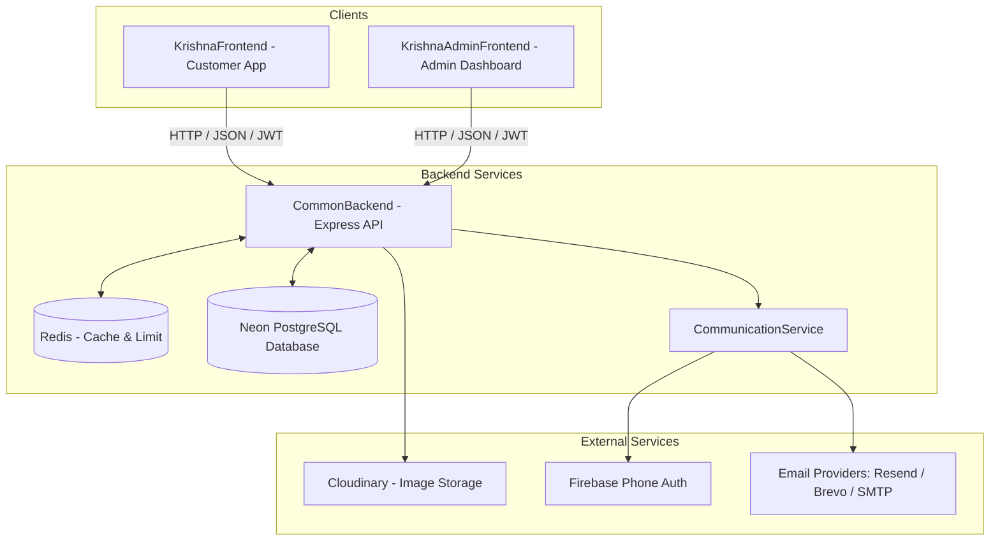

# System Architecture: Krishna Footwear

## 1. Overall System Architecture
The Krishna Footwear ecosystem follows a modern decoupled architecture comprising two frontend web clients and a single unified backend API server with provider-independent communication services.



## 2. App Communication Flow
* **Protocol**: All communication between frontends and backend is conducted over secure HTTP (HTTPS) using RESTful API principles.
* **Payload Format**: JSON (application/json) is used for request and response payloads.
* **State Management**: The frontends are stateless SPA applications. Session state is managed via secure, client-side stored JWT (Json Web Tokens).

## 3. Communication & Authentication Architecture
* **Firebase Phone Authentication**: Client-side Firebase Web Auth SDK handles phone OTP generation, delivery, expiration, and replay protection. The backend verifies client-authenticated ID tokens via `firebaseAuthProvider.js`.
* **Provider-Independent Email OTP Strategy**: `communicationService.js` provides a pluggable `EmailProvider` interface:
  1. `ResendProvider` (`RESEND_API_KEY`)
  2. `BrevoProvider` (`BREVO_API_KEY`)
  3. `SMTPProvider` (Nodemailer for local development/fallback)

## 4. Backend Request Lifecycle
Every incoming HTTP request to the backend flows through a structured chain of processing layers:

```
[Incoming Request] 
      │
      ▼
┌──────────────┐
│ CORS / HTTP  │
│ Verification │
└──────┬───────┘
       │
       ▼
┌──────────────┐
│  Rate Limit  │ (Using Redis/Express-Rate-Limit)
└──────┬───────┘
       │
       ▼
┌──────────────┐
│ Auth & Roles │ (JWT validation, Role checks)
└──────┬───────┘
       │
       ▼
┌──────────────┐
│ Input Valid  │ (Joi schemas)
└──────┬───────┘
       │
       ▼
┌──────────────┐
│ Controller   │ ➔ calls CommunicationService / Repositories
└──────┬───────┘
       │
       ▼
┌──────────────┐
│ Repositories │ (Neon PostgreSQL queries / CacheService)
└──────┬───────┘
       │
       ▼
[JSON Response Envelope]
```
