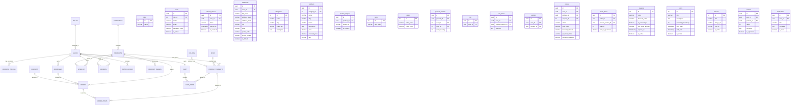

# Database ER Diagram: Krishna Footwear

This document presents the visual Entity-Relationship (ER) model for the database schema using Mermaid.

```mermaid
erDiagram
    ROLES ||--o{ USERS : "assigned_to"
    USERS ||--o{ REFRESH_TOKENS : "has_sessions"
    USERS ||--o{ ADDRESSES : "owns"
    USERS ||--o{ ORDERS : "places"
    USERS ||--|| CART : "owns"
    USERS ||--o{ WISHLIST : "saves"
    USERS ||--o{ REVIEWS : "writes"
    USERS ||--o{ NOTIFICATIONS : "receives"

    CATEGORIES ||--o{ PRODUCTS : "classifies"
    PRODUCTS ||--o{ PRODUCT_IMAGES : "has_photos"
    PRODUCTS ||--o{ PRODUCT_VARIANTS : "has_options"
    PRODUCTS ||--o{ WISHLIST : "saved_in"
    PRODUCTS ||--o{ REVIEWS : "rated_in"

    SIZES ||--o{ PRODUCT_VARIANTS : "defines_size"
    COLORS ||--o{ PRODUCT_VARIANTS : "defines_color"
    PRODUCT_VARIANTS ||--o{ CART_ITEMS : "added_in"
    PRODUCT_VARIANTS ||--o{ ORDER_ITEMS : "ordered_in"

    CART ||--o{ CART_ITEMS : "contains"
    ADDRESSES ||--o{ ORDERS : "shipped_to"
    COUPONS ||--o{ ORDERS : "applied_to"
    ORDERS ||--o{ ORDER_ITEMS : "comprises"

    roles {
        int id PK
        varchar name
    }

    users {
        uuid id PK
        int role_id FK
        varchar name
        varchar email
        varchar password_hash
        boolean is_active
    }

    refresh_tokens {
        uuid id PK
        uuid user_id FK
        varchar token
        timestamp expires_at
        boolean is_revoked
    }

    addresses {
        uuid id PK
        uuid user_id FK
        varchar full_name
        varchar address_line1
        varchar address_line2
        varchar city
        varchar state
        varchar postal_code
        varchar phone_number
        boolean is_default
    }

    categories {
        int id PK
        varchar name
        varchar slug
        varchar image_url
        text description
    }

    products {
        uuid id PK
        int category_id FK
        varchar name
        varchar slug
        varchar brand
        text description
        decimal price
        decimal discount_price
        varchar sku
    }

    product_images {
        uuid id PK
        uuid product_id FK
        varchar image_url
        boolean is_primary
    }

    sizes {
        int id PK
        varchar size_label
    }

    colors {
        int id PK
        varchar color_name
        varchar color_code
    }

    product_variants {
        uuid id PK
        uuid product_id FK
        int size_id FK
        int color_id FK
        int stock_quantity
    }

    cart {
        uuid id PK
        uuid user_id FK
    }

    cart_items {
        uuid id PK
        uuid cart_id FK
        uuid product_variant_id FK
        int quantity
    }

    wishlist {
        uuid id PK
        uuid user_id FK
        uuid product_id FK
    }

    orders {
        uuid id PK
        uuid user_id FK
        uuid address_id FK
        int coupon_id FK
        varchar status
        decimal total_price
        decimal discount_amount
        varchar payment_status
        varchar payment_reference
    }

    order_items {
        uuid id PK
        uuid order_id FK
        uuid product_variant_id FK
        int quantity
        decimal price_at_purchase
    }

    coupons {
        int id PK
        varchar code
        decimal discount_value
        boolean is_percentage
        decimal min_order_amount
        timestamp expires_at
        boolean is_active
    }

    offers {
        int id PK
        varchar title
        text description
        int discount_percentage
        timestamp start_date
        timestamp end_date
        boolean is_active
    }

    banners {
        int id PK
        varchar title
        varchar image_url
        varchar link_url
        boolean is_active
    }

    reviews {
        uuid id PK
        uuid user_id FK
        uuid product_id FK
        int rating
        text comment
        boolean is_approved
    }

    notifications {
        uuid id PK
        uuid user_id FK
        varchar title
        text message
        boolean is_read
    }
```
